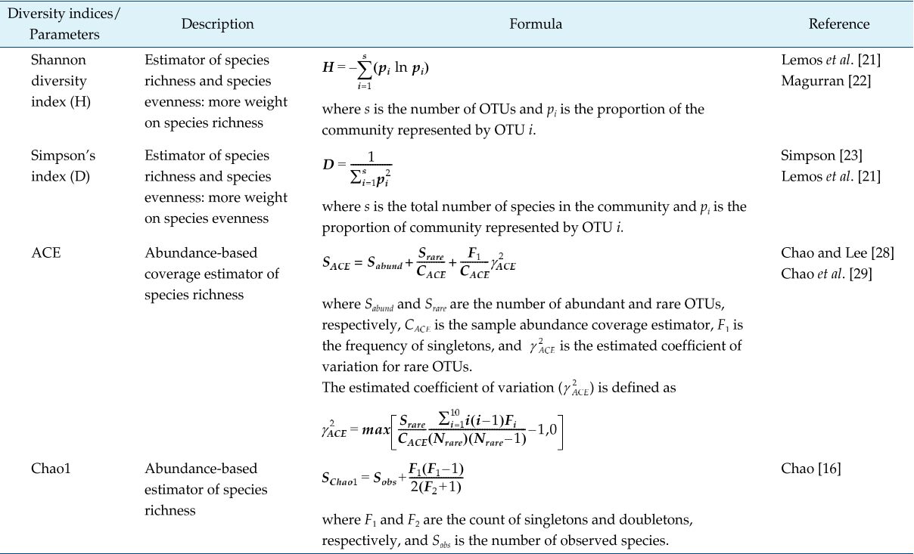

```{r setup, include=FALSE}
library(phyloseq)
library(tidyverse)
library(ggplot2)
library(stats)
library(agricolae)
library(ggpubr)
library(kableExtra)
library(phylosmith)
library(data.table)
library(microbiome)
```

# Introduction

Diversity in microbial communities is a challenging question to tackle. Here we explore the alpha and beta diversity of the two rainfall simulations. We then use a phylogenetic tree to add another dimension to out alpha and beta diversity analysis. Using a phylogenetic tree allows us to incorporate evolutionary differences in sequences, which may be more informative only using number and abundance of species in a sample. 

We will look at 3 measures of diversity: observed number of species, Shannon diversity index, and Simpson diversity index. 



```{r}
# Read in all strips samples
altstrips <- readRDS("data/all_samples_merged_STRIPS.RDS") 
```

First we can check the number of reads in each sample, after evaluating a rarefaction curve, we found that ~10,000k reads sufficiently captured the species diversity in each sample. We can look at which samples are below 10k reads and that would be lost if we rarefy to 10k reads in each sample. 

```{r}
# simple plot of sample sums
data.frame(sample_sums(altstrips)) %>%
  cbind(., data.frame(sample_data(altstrips))) %>%
  rownames_to_column(var = "Sample") %>%
  as_tibble() %>%
  filter(sample_sums.altstrips. <= 10000) %T>% {print(paste0(nrow(.)," samples with less than 10k"))} %>% # print number of samples with less than 10k to the console
  ggplot(aes(x = reorder(Sample, sample_sums.altstrips.), y = sample_sums.altstrips.)) + 
  geom_bar(stat = "identity", aes(fill = matrix)) + 
  theme(axis.text.x = element_text(angle = 90, hjust = 1)) +
  facet_grid(depth~experiment)
```

It appears there is a fairly balanced distribution of < 10k reads, maybe a few more in WORLE than Armstrong. 

# Depth 1 WORLE

The first 7 cm of soil are depth one, we will compare these samples from prairie and ag portions of the plot. Let's take a look at the total observed number of ASVs and the Simpson and Shannon diversity index at the WORLE site. We will compare samples from the treatment that did not receive manure.

```{r depth 1 subset}
# Subset to WORLE depth one no manure, exclude the border sample from each plot. 
Wd1 <- subset_samples(altstrips, experiment %in% "Worle_Rainfall" & manure_treatment %in% "N" & !soil_type %in% "border" & depth %in% "1") 

kable(data.frame(sample_data(Wd1))) %>%
  kable_styling(bootstrap_options = "striped") %>%
  scroll_box(width = "100%", height = "600px")
```
```{r}
summarize_phyloseq(Wd1)
plot_richness(Wd1, measures = c("Observed", "Shannon", "Simpson"), scales = "free")
tab <- microbiome::alpha(Wd1, index = "all") # Alternative package to calculate diversity `microbiome`
head(tab)
```

Let's start by looking at the Shannon and Simpson diversity between crop and ag for baseline samples at WORLE and Armstrong, before rainfall simulation. This will include all treatments because manure had not been applied at this point, making it fair to compare all treatments without worrying about the influence of the manure community. 

```{r}
Wdbase <- subset_samples(altstrips, experiment %in% "Worle_Rainfall" & sample_day %in% "Baseline" & !soil_type %in% "border" & depth %in% "1") 
Adbase <- subset_samples(altstrips, experiment %in% "Armstrong_Rainfall" & sample_day %in% "Baseline" & !soil_type %in% "border" & depth %in% "1") 

#Wdbaserichness <- estimate_richness(Wdbase)
#Adbaserichness <- estimate_richness(Adbase)

sample_data(Wdbase) %>%
  lapply(., factor) %>%
  as_tibble() %>%
  cbind(., estimate_richness(Wdbase, )) %>%
  ggboxplot(x = "soil_type", y = "Shannon", add = "jitter", notch = F, color = "soil_type") + 
  stat_compare_means() +
  theme(legend.position = "none") +
  ggtitle("Shannon diversity index of WORLE baseline detph 1 soils") +
  ylab("Shannon Diversity") +
  scale_color_viridis_d() +
  scale_x_discrete(name = "Soil type", labels = c("crop" = "Ag soil", "strip" = "Prairie strip soil"))

print(min(taxa_sums(Wdbase)))

# Armstrong
sample_data(Adbase) %>%
  lapply(., factor) %>%
  as_tibble() %>%
  cbind(., estimate_richness(Adbase, )) %>%
  ggboxplot(x = "soil_type", y = "Shannon", add = "jitter", notch = F, color = "soil_type") + 
  stat_compare_means() +
  theme(legend.position = "none") +
  ggtitle("Shannon diversity index of Armstrong baseline detph 1 soils") +
  ylab("Shannon Diversity") +
  scale_color_viridis_d() +
  scale_x_discrete(name = "Soil type", labels = c("crop" = "Ag soil", "strip" = "Prairie strip soil"))

print(min(taxa_sums(Wdbase)))
```
```{r}
# Simpson diversity
# WORLE
sample_data(Wdbase) %>%
  lapply(., factor) %>%
  as_tibble() %>%
  cbind(., estimate_richness(Wdbase, )) %>%
  ggboxplot(x = "soil_type", y = "Simpson", add = "jitter", notch = F, color = "soil_type") + 
  stat_compare_means() +
  theme(legend.position = "none") +
  ggtitle("Simpson diversity index of WORLE baseline detph 1 soils") +
  ylab("Simpson Diversity") +
  scale_color_viridis_d() +
  scale_x_discrete(name = "Soil type", labels = c("crop" = "Ag soil", "strip" = "Prairie strip soil"))


# Armstrong
sample_data(Adbase) %>%
  lapply(., factor) %>%
  as_tibble() %>%
  cbind(., estimate_richness(Adbase, )) %>%
  ggboxplot(x = "soil_type", y = "Simpson", add = "jitter", notch = F, color = "soil_type") + 
  stat_compare_means() +
  theme(legend.position = "none") +
  ggtitle("Simpson diversity index of Armstrong baseline detph 1 soils") +
  ylab("Simpson Diversity") +
  scale_color_viridis_d() +
  scale_x_discrete(name = "Soil type", labels = c("crop" = "Ag soil", "strip" = "Prairie strip soil"))


```
```{r}
sample_data(Wdbase) %>%
  lapply(., factor) %>%
  as_tibble() %>%
  cbind(., estimate_richness(Wdbase, )) %>%
  ggboxplot(x = "soil_type", y = "Observed", add = "jitter", notch = F, color = "soil_type") + 
  stat_compare_means() +
  theme(legend.position = "none") +
  ggtitle("Observed diversity of WORLE baseline detph 1 soils") +
  ylab("Observed Diversity") +
  scale_color_viridis_d() +
  scale_x_discrete(name = "Soil type", labels = c("crop" = "Ag soil", "strip" = "Prairie strip soil"))


# Armstrong
sample_data(Adbase) %>%
  lapply(., factor) %>%
  as_tibble() %>%
  cbind(., estimate_richness(Adbase, )) %>%
  ggboxplot(x = "soil_type", y = "Observed", add = "jitter", notch = F, color = "soil_type") + 
  stat_compare_means() +
  theme(legend.position = "none") +
  ggtitle("Observed diversity of Armstrong baseline detph 1 soils") +
  ylab("Observed Diversity") +
  scale_color_viridis_d() +
  scale_x_discrete(name = "Soil type", labels = c("crop" = "Ag soil", "strip" = "Prairie strip soil"))
```

Prior to rainfall simulation, there were no differences in Shannon or Simpson or Richness (observed) diversity of the baseline soils when comparing prairie soil to crop soil at each site. 

Let's now look at differences by time for each site. 

```{r Over Time Shannon}
sample_data <- sample_data(Wd1) %>%
  lapply(., factor) %>%
  as_tibble() 

richness <- estimate_richness(Wd1) 

sample_data <- cbind(sample_data, richness)

p <- ggboxplot(sample_data, x = "sample_day", y = "Shannon", color = "soil_type", add = "jitter", notch = F)
p
plot <- p + stat_compare_means(aes(group = soil_type), label = "p.signif") +
  ggtitle("Shannon diversity index of WORLE detph 1 soils") +
  ylab("Shannon Diversity") +
  xlab("Sampling Day") + scale_color_viridis_d(name = "Managment", labels = c("Ag", "Prairie"))
plot
ggsave("images/WorleD1Shannon.png", plot = plot, device = "png", width = 6, height = 4, units = "in")
```

We see some differences on T002, which was two days after the rainfall simulation. The added moisture likely caused an increase in bacteria. Had we measured microbial biomass carbon, I would have expected to see an increase. We could confirm the increase by using 16s primers and qPCR for these samples. 

```{r Simpson}
p <- ggboxplot(sample_data, x = "sample_day", y = "Simpson", color = "soil_type", add = "jitter")

plot <- p + stat_compare_means(aes(group = soil_type), label = "p.signif") +
  ggtitle("Simpson diversity index of WORLE detph 1 soils") +
  ylab("Simpson Diversity") +
  xlab("Sampling Day") + scale_color_viridis_d()
plot
ggsave("images/WorleD1Simpson.png", plot = plot, device = "png", width = 6, height = 4, units = "in")
```
```{r Observed}
p <- ggboxplot(sample_data, x = "sample_day", y = "Observed", color = "soil_type", add = "jitter")

plot <- p + stat_compare_means(aes(group = soil_type), label = "p.signif") +
  ggtitle("Observed number of species in WORLE detph 1 soils") +
  ylab("Observed species") +
  xlab("Sampling Day") + scale_color_viridis_d(name = "Managment", labels = c("Ag", "Prairie"))
plot
ggsave("images/WorleD1observed.png", plot = plot, device = "png", width = 6, height = 4, units = "in")
```
Let's take a look at Armstrong depth 1 soils: 

```{r armstrongdepth 1 subset}
# Subset to WORLE depth one no manure, exclude the border sample from each plot. 
Ad1 <- subset_samples(altstrips, experiment %in% "Armstrong_Rainfall" & manure_treatment %in% "N" & !soil_type %in% "border" & depth %in% "1") 

kable(data.frame(sample_data(Ad1))) %>%
  kable_styling(bootstrap_options = "striped") %>%
  scroll_box(width = "100%", height = "600px")
```

```{r}
sample_data <- sample_data(Ad1) %>%
  lapply(., factor) %>%
  as_tibble() %>%
  cbind(., estimate_richness(Ad1, )) 

p <- ggboxplot(sample_data, x = "sample_day", y = "Observed", color = "soil_type", add = "jitter")

plot <- p + stat_compare_means(aes(group = soil_type), label = "p.signif") +
  ggtitle("Observed number of species in Armstrong detph 1 soils") +
  ylab("Observed species") +
  xlab("Sampling Day") + scale_color_viridis_d(name = "Managment", labels = c("Ag", "Prairie"))
plot
ggsave("images/ArmstrongD1observed.png", plot = plot, device = "png", width = 6, height = 4, units = "in")

```


Rarefied Diversity

Rarefaction is important for making sound judgments when comparing two sites (samples) in this case, our sequencing wasn't even between all samples, so we are randomly re-sampling each at 10k reads. This removes a few samples that had less than 10k reads, we cannot include them in the comparison because the were under-sampled. 


```{r}
rWd1 <- rarefy_even_depth(Wd1, sample.size = 10000, rngseed = 12121212, trimOTUs = T)
```

```{r Rare Richness}
rsample_data1 <- sample_data(rWd1) %>%
  lapply(., factor) %>%
as_tibble()
richness <- estimate_richness(rWd1) 
rsample_data <- cbind(rsample_data1, richness)
rm(rsample_data1)
```

```{r Shannon rarefied}
p <- ggboxplot(rsample_data, x = "sample_day", y = "Shannon", fill = "soil_type", add = "jitter")

plot <- p + stat_compare_means(aes(group = soil_type), label = "p.signif") +
  ggtitle("Shannon diversity index of WORLE detph 1 soils, rarefied to 10k") +
  ylab("Shannon Diversity") +
  xlab("Sampling Day") + scale_fill_viridis_d(name = "Managment", labels = c("Ag", "Prairie"))
plot
ggsave("images/rWd1Shannon.png", plot = plot, device = "png", width = 6, height = 4, units = "in")
```

# Prairie and Crop Pairwise

Just prairie and crop soils pairwise comparison, we can see if any of the days were significantly more or less diverse than the other. The lines on the graph connect the two samples that are being compared. 

Here we can see that there is more within season change of diversity in prairie soils as compared to ag soils. 

Sample day 2 and 21 have significant increases in diversity.
```{r}
p <- rsample_data %>%
  filter(soil_type == "strip") %>%
  ggboxplot(x = "sample_day", y = "Shannon", add = "jitter")

my_comparisons <- list( c("T002", "T014"), c("T002", "T000"), c("Baseline", "T000"), c("T014", "T021"), c("T021", "T042"))

plot <- p + stat_compare_means(comparisons = my_comparisons, label = "p.signif") +
  ggtitle("Shannon diversity index of WORLE detph 1 prairie soils, rarefied 10k") +
  ylab("Shannon Diversity") +
  xlab("Sampling Day") 
plot

p <- rsample_data %>%
  filter(soil_type == "crop") %>%
  ggboxplot(x = "sample_day", y = "Shannon", add = "jitter")

my_comparisons <- list( c("T002", "T014"), c("T002", "T000"), c("Baseline", "T000"), c("T014", "T021"), c("T021", "T042"))

plot <- p + stat_compare_means(comparisons = my_comparisons, label = "p.signif") +
  ggtitle("Shannon diversity index of WORLE detph 1 ag soils, rarefied 10k") +
  ylab("Shannon Diversity") +
  xlab("Sampling Day") 
plot
```

```{r}
p <- sample_data %>%
  filter(soil_type == "strip") %>%
  ggboxplot(x = "sample_day", y = "ACE", add = "jitter")

my_comparisons <- list( c("T002", "T014"), c("T002", "T000"), c("Baseline", "T000"), c("T014", "T021"), c("T021", "T042"))

plot <- p + stat_compare_means(comparisons = my_comparisons, label = "p.signif") +
  ggtitle("ACE diversity index of WORLE depth 1 prairie soils") +
  ylab("ACE Diversity") +
  xlab("Sampling Day") 
plot
```

#### Depth 2 

What about the second depth of the soil samples, 7-15 cm? 

```{r depth 2 subset}
Wd2 <- subset_samples(altstrips, experiment %in% "Worle_Rainfall" & manure_treatment %in% "N" & !soil_type %in% "border" & depth %in% "2") 
Wd2
kable(data.frame(sample_data(Wd2))) %>%
  kable_styling(bootstrap_options = "striped") %>%
  scroll_box(width = "100%", height = "600px")
```

```{r ACE 2}
sample_data <- sample_data(Wd2) %>%
  lapply(., factor) %>%
  as_tibble() 
  
richness <- estimate_richness(Wd2) 
sample_data <- cbind(sample_data, richness)

p <- ggboxplot(sample_data, x = "sample_day", y = "ACE", fill = "soil_type", add = "jitter")

plot <- p + stat_compare_means(aes(group = soil_type), label = "p.signif") +
  ggtitle("ACE diversity index of WORLE detph 2 soils") +
  ylab("ACE Diversity") +
  xlab("Sampling Day") + scale_fill_viridis_d(name = "Managment", labels = c("Ag", "Prairie"))
plot
ggsave("images/WorleD2ACE.png", plot = plot, device = "png", width = 6, height = 4, units = "in")
```

```{r Chao1 2}
sample_data <- sample_data(Wd2) %>%
  lapply(., factor) %>%
  as_tibble() 
  
richness <- estimate_richness(Wd2) 
sample_data <- cbind(sample_data, richness)

p <- ggboxplot(sample_data, x = "sample_day", y = "Chao1", fill = "soil_type", add = "jitter")

plot <- p + stat_compare_means(aes(group = soil_type), label = "p.signif") +
  ggtitle("Chao1 diversity index of WORLE detph 2 soils") +
  ylab("Chao1 Diversity") +
  xlab("Sampling Day") + scale_fill_viridis_d(name = "Managment", labels = c("Ag", "Prairie"))
plot
ggsave("images/WorleD2Chao1.png", plot = plot, device = "png", width = 6, height = 4, units = "in")
```

```{r}
rWd2 <- rarefy_even_depth(Wd2, sample.size = 10000, rngseed = 12121212, trimOTUs = T)
```

```{r Shannon rare 2}
sample_data2 <- sample_data(rWd2) %>%
  lapply(., factor) %>%
  as_tibble() 
  
richness <- estimate_richness(rWd2) 
sample_data2 <- cbind(sample_data2, richness)

p <- ggboxplot(sample_data2, x = "sample_day", y = "Shannon", fill = "soil_type", add = "jitter")

plot <- p + stat_compare_means(aes(group = soil_type), label = "p.signif") +
  ggtitle("Shannon diversity index of WORLE detph 2 soils rarefied to 10k reads") +
  ylab("Shannon Diversity") +
  xlab("Sampling Day") + scale_fill_viridis_d(name = "Managment", labels = c("Ag", "Prairie"))
plot
ggsave("images/WorlerD2Shannon.png", plot = plot, device = "png", width = 6, height = 4, units = "in")
```


```{r}
# sample data 2 is rarefied, this is shannon
p <- sample_data2 %>%
  filter(soil_type == "strip") %>%
  ggboxplot(x = "sample_day", y = "Shannon", add = "jitter")

my_comparisons <- list( c("T002", "T014"), c("T002", "T000"), c("Baseline", "T000"), c("T014", "T021"), c("T021", "T042"))

plot <- p + stat_compare_means(comparisons = my_comparisons, label = "p.signif") +
  ggtitle("Shannon diversity index of WORLE detph 2 Prairie soils, rarefied to 10k") +
  ylab("Shannon Diversity") +
  xlab("Sampling Day") 
plot

p <- sample_data2 %>%
  filter(soil_type == "strip") %>%
  ggboxplot(x = "sample_day", y = "Simpson", add = "jitter")

plot <- p + stat_compare_means(comparisons = my_comparisons, label = "p.signif") +
  ggtitle("Simpson diversity index of WORLE detph 2 Prairie soils, rarefied to 10k") +
  ylab("Simpson Diversity") +
  xlab("Sampling Day") 
plot
```
```{r}
p <- sample_data %>%
  filter(soil_type == "strip") %>%
  ggboxplot(x = "sample_day", y = "ACE", add = "jitter")

my_comparisons <- list( c("T002", "T014"), c("T002", "T000"), c("Baseline", "T000"), c("T014", "T021"), c("T021", "T042"))

plot <- p + stat_compare_means(comparisons = my_comparisons, label = "p.signif") +
  ggtitle("ACE diversity index of WORLE depth 2 Prairie soils") +
  ylab("ACE Diversity") +
  xlab("Sampling Day") 
plot
```

### Armstrong Depth 1

Depth 1 over time, comparison between prairie and crop at each time
```{r}
Ad1 <- subset_samples(altstrips, experiment %in% "Armstrong_Rainfall" & manure_treatment %in% "N" & !soil_type %in% "border" & depth %in% "1") %>%
  filter_taxa(function(x) sum(x) >= 1, T)
Ad1
kable(data.frame(sample_data(Ad1))) %>%
  kable_styling(bootstrap_options = "striped") %>%
  scroll_box(width = "100%", height = "600px")
```

Baseline of all treatments depth 1 in Armstrong soils
```{r}
Abase <- subset_samples(altstrips, experiment %in% "Armstrong_Rainfall" & sample_day %in% "Baseline" & !soil_type %in% "border" & depth %in% "1") %>%
  filter_taxa(function(x) sum(x) >= 1, T) 

sample_data(Abase) %>%
  lapply(., factor) %>%
  as_tibble() %>%
  cbind(., estimate_richness(Abase)) %>%
  ggboxplot(x = "sample_day", y = "ACE", fill = "soil_type", add = "jitter", notch = T) + 
  stat_compare_means(aes(group = soil_type), label = "p.signif") +
  ggtitle("ACE diversity index of Armstrong baseline detph 1 soils") +
  ylab("ACE Diversity") +
  xlab("Sampling Day") + scale_fill_viridis_d(name = "Managment", labels = c("Ag", "Prairie"))
```

# Beta Diversity

We will prune a lot of OTUs to make analysis quicker, observed at least 3 times in 20% of samples

```{r}
strips <- readRDS("data/all_samples_merged_STRIPS.RDS") 

Allbase <- subset_samples(strips, sample_day %in% "Baseline" & !soil_type %in% "border" & depth %in% "1") %>%
  filter_taxa(function(x) sum(x >= 3) > (0.2*length(x)), T) 

rm(strips)
taxa_names(Allbase) <- paste0("ASV", seq(ntaxa(Allbase)))
```
```{r}
ordinate(Allbase, "PCoA", "bray") %>% 
  plot_ordination(Allbase, ., color = "soil_type", shape = "experiment", title = "Bray-Curtis PCoA") 
```
```{r}
ordinate(Allbase, "NMDS", "bray") %>% 
  plot_ordination(Allbase, ., color = "soil_type", shape = "experiment", title = "Bray-Curtis NMDS") 
```

# Phylogenetic tree 

Construct phylogenetic tree, from: https://f1000research.com/articles/5-1492/v2

```{r}
optimiezedTree <- readRDS("data/d1mintax5tree.RDS") 

Allbasewtree <- merge_phyloseq(Allbase, phy_tree(optimiezedTree))
Allbasewtree
```

```{r}
ordinate(Allbasewtree, "NMDS", "wunifrac") %>% 
  plot_ordination(Allbasewtree, ., color = "soil_type", shape = "experiment", title = "wunifrac") 
```
What about at just one site? WORLE:

```{r}
worle <- subset_samples(Allbasewtree, experiment %in% "Worle_Rainfall") %>%
  filter_taxa(function(x) sum(x) >= 1, T)
worle
```
```{r}
ordinate(worle, "NMDS", "wunifrac") %>% 
  plot_ordination(worle, ., color = "soil_type", title = "wunifrac at WORLE") + 
  stat_ellipse(geom = "polygon", type = "norm", alpha = 0.1, aes(fill = soil_type)) 
adonis(phyloseq::distance(worle, method = "wunifrac") ~ soil_type, data = data.frame(sample_data(worle)))
```

```{r}
Wd1 <- subset_samples(altstrips, experiment %in% "Worle_Rainfall" & manure_treatment %in% "N" & !soil_type %in% "border" & depth %in% "1")
taxa_names(Wd1)

singles <- function(phy){
   df <- as(otu_table(phy), "matrix") %>%
    as_tibble(rownames = "ASV") %>%
    filter_all(any_vars(. == 1)) %>%
    select_if(~max(.) > 0)
  return(df)
}
singles(Wd1)
```

